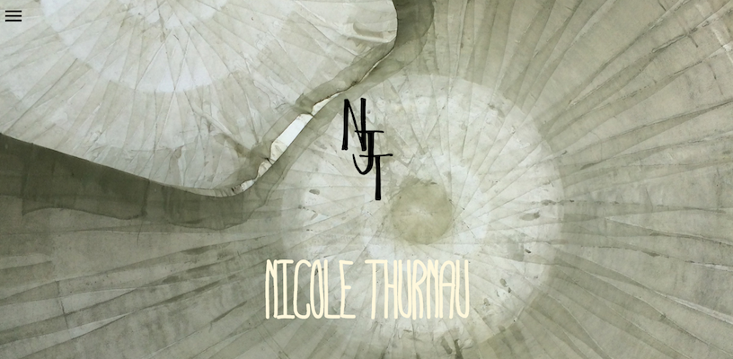
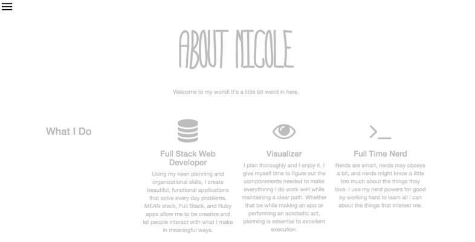
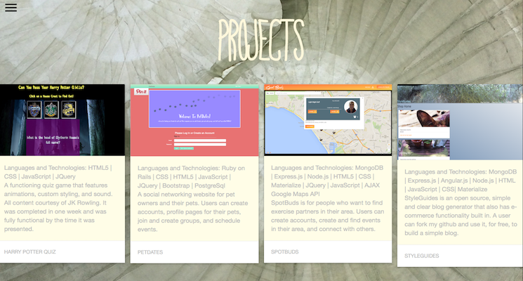
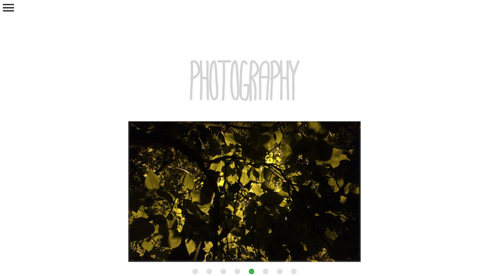

#Personal Portfolio
This portfolio showcases the web apps, projects, practice apps, and skills that Nicole Thurnau has worked on to date.

####Technologies and Libraries Used
- HTML 5
- CSS3
- Materialzecss, Bootstrap, FontAwesome
- All photographs are my own, including the main background theme and logo

####Screenshots
The Landing Page includes my logo, my own photograph set as the background, and an animated hamburger which opens into the side navigation menu. The hamburger and sidenav are available on all pages.  

 
The About page contains information about my work experience, hobbies, and background. The design is inline with my colorscheme and theme photos. This page is also fully responsive. Icons are from FontAwesome.com.  

 
The Projects page contains snippets that describe each portfolio piece I have created to date. The responsive cards were made using materialize. Again, the design is consistent with other areas within the site and this page is responsive.  

 
The Photography page contains a photo slider with images that I have taken and edited myself. In one case, the photo is of a sculpture that I created using tiny rocks and items found on a beach. The page is simple and stark so that the photos are the main focus. It's also mostly responsive.  

